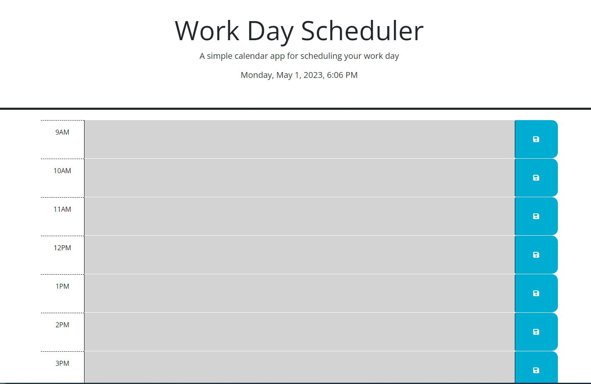

# Challenge 5

## Work Calendar

This work calendar is designed to have the following features:
* Display the day and time at the top of the calendar.
* Timeblocks visible capture a standard work-day starting at the 9AM hour and ending at the 5PM hour.
* You'll notice that the timeblocks are color-coded to indicate whether that hour is in the past, present, or future.
* When you enter an event into a timeblock, remember to hit the "Save" button!  The page will save your event into local storage and persist even when you refresh the page.

I had starter code to work with and didn't alter the HTML too much with the exception of adding a footer and replacing classes and adding data attributes to each of the time blocks.  The purpose of replacing classes and adding the data attribute of "data-hour" is so that I could write the javascript to be able to interact with day.js (comparing the current time to the time on the calendar) as well as jQuery to traverse the DOM.   I hope you enjoy it!

## Screenshot

(This screenshot was taken at 5:30PM but when you pull it up during work hours you will see it is color-coded)

## Links

https://github.com/GSuhir/work-calendar

https://gsuhir.github.io/work-calendar/

